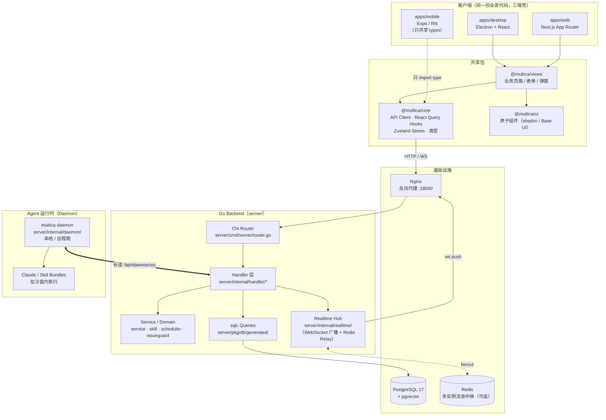
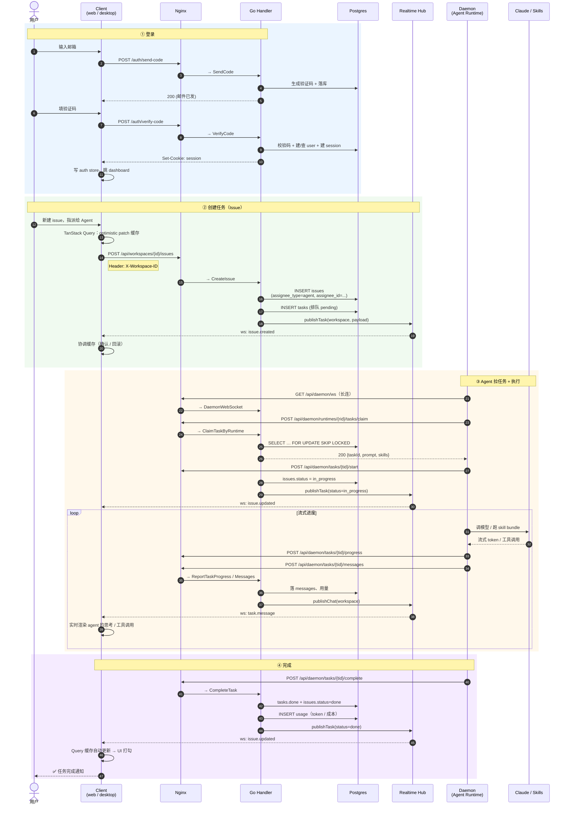
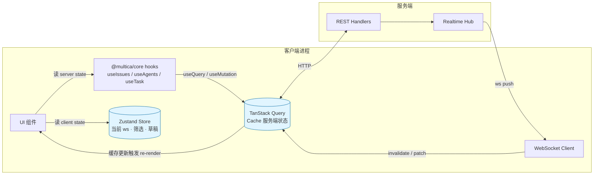

# Multica 端到端架构：从登录到任务完成

> 演讲材料 · 配合 3 张图讲完一整条主链路

---

## 一、系统分层架构

**讲解要点**

- **三端一套业务代码**：Web / Desktop 直接共享 `views + core + ui`；Mobile 独立但共享类型，保持产品语义一致（计数、权限、状态机）。
- **state 分两层**：TanStack Query 管服务端状态（issues、agents、members），Zustand 管客户端状态（当前 workspace、筛选器、草稿）。WebSocket 事件只回写 Query 缓存，不动 Zustand。
- **realtime 是一等公民**：所有写操作走完数据库后立刻 publish 给 Hub，Hub 通过 WebSocket 推到所有连接的客户端，多实例时通过 Redis Relay 跨节点广播。
- **Daemon 是 agent 的执行器**：跟后端建一条长连 WebSocket，主动拉任务、上报进度、上传消息——agent 不是服务端线程，是独立进程。

---

## 二、端到端时序：登录 → 创建 → 执行 → 完成

**讲解要点（按节奏念）**

1. **登录段**：两步走——拿验证码、验证。后端落 session，前端把 cookie 拿到手就进 dashboard。Google OAuth 是同样的形状，多一层回调。
2. **创建段**：注意一句关键——**optimistic mutation**。UI 不等服务端，先在本地缓存上把 issue 摆出来，请求失败再回滚。这是用户感知"丝滑"的根因。
3. **执行段**：这里是 Multica 区别于传统任务系统的核心——**agent 是真正的 assignee**。Daemon 跟服务端是 WebSocket 长连，主动 claim 任务，进入沙盒跑 Claude/skill；每一步思考、每一次工具调用都通过 progress 接口流回服务端，再通过 realtime Hub 推给所有看着这个 issue 的人。**用户能看到 agent 在干什么**，不是黑盒。
4. **完成段**：daemon 上报 complete，服务端改 issue 状态、记账（token/usage），广播。客户端缓存被动更新，issue 在列表里自动打勾——**全过程没有手动刷新**。

---

## 三、数据流：state 与 realtime 的协作

**讲解要点**

- **TanStack Query 是唯一的服务端状态来源**。所有 issue、agent、member 数据都在它的缓存里。
- **WebSocket 不绕过 Query**：服务端推消息过来，前端不直接改 Zustand，而是去 `invalidate` 或 `patch` Query 缓存，让缓存触发组件重渲染。这条规则在 `CLAUDE.md` 里是硬约束。
- **Zustand 只放"客户端的事"**：你选了哪个 workspace、筛选条件是什么、tab 布局——这些跟服务器无关的状态。
- 这种分离让"**多端同步**"变得自然：同一个 issue，你在 Web 上改了，Desktop 和手机上几乎瞬时看到——因为它们订阅了同一个 WebSocket 频道，更新了各自的 Query 缓存。

---

## 四、演讲收束（一句话总结）

> **Multica 把"agent"做成了任务系统的一等公民**——它有 ID、能被 @、能被指派、能改状态、能在所有人面前实时干活；后端通过 sqlc + Postgres 保证一致性，realtime Hub 保证三端实时同步，daemon 把模型执行从服务端剥离出来跑在沙盒里——这套架构让 AI 协作从"调 API"升级成"团队成员"。

---

## 附：关键文件索引（万一被问细节）

| 关注点 | 位置 |
|---|---|
| HTTP 路由总表 | `server/cmd/server/router.go` |
| 登录 / 验证码 / Google OAuth | `server/internal/handler/auth.go`（`VerifyCode:350`, `GoogleLogin:464`） |
| Issue 创建 / 更新 | `server/internal/handler/issue.go`（`CreateIssue:2078`, `UpdateIssue:2333`） |
| Daemon 任务生命周期 | `server/internal/handler/daemon.go`（`ClaimTaskByRuntime:1227`, `StartTask:2054`, `ReportTaskProgress:2121`, `CompleteTask:2155`, `FailTask:2325`） |
| Daemon WebSocket | `server/internal/handler/daemon_ws.go:11` |
| Realtime 广播 | `server/internal/realtime/sharded_stream_relay.go`, `redis_relay.go` |
| 事件 publish 入口 | `server/internal/handler/handler.go`（`publish:310`, `publishTask:322`, `publishChat:335`） |
| Daemon 主程序 | `server/internal/daemon/daemon.go` |
| 客户端 API/hooks | `packages/core/api/`, `packages/core/queries/` |
| 共享业务页面 | `packages/views/` |
